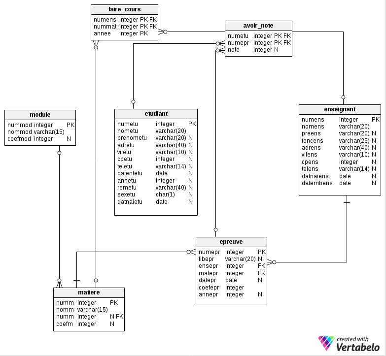
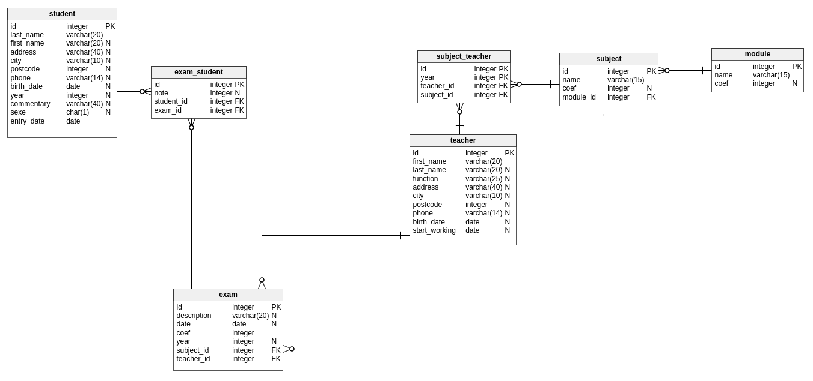

# En action
J'ai normalisé une base de données que vous avez déjà utilisé. Voici le schéma de l'ancienne base :  
   
Et voici la nouvelle base :  
  

Le DDL et les données de remplissage arrivent bientôt pour que vous puissiez vous amuser avec cette base.