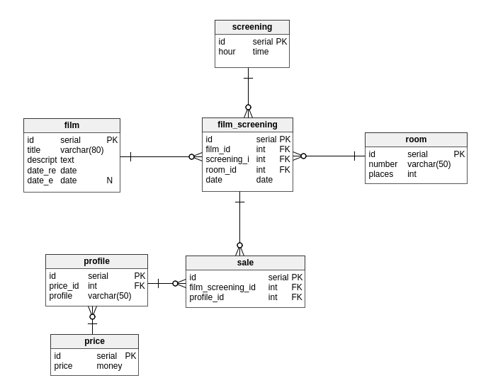

# D'où provient le projet ?
Lorsque je souhaite apprendre une nouvelle technologie je créé un nouveau projet, portant sur le monde réel. Actuellement j'apprend nodeJS avec ExpressJS il me fallait un nouveau projet, ayant vu un cinéma... *(ehh oui, l'inspiration viens de loin!)*.  
Je tiens à préciser que ça ne reflète peut-être pas parfaitement la réalité, j'ai peut-être oublié quelques attributs. Si vous avez des idées, n'hésitez pas.
# Présentation de la base de données :
Premièrement, regardez le DDL disponible [ici](https://github.com/EmixMaxime/learn-nodejs-bydoing/blob/master/migrations/sqls/global.sql).  
L'idée de l'application, c'est de réaliser un système informatique similaire à celui d'un cinéma.  

# Tables en associations avec film :
Ma grosse entité `film_screening` représente une séance de cinéma. Elle reprend toutes les informations relatives à une séance :
- Une `room` pour récupérer le nombre de place et le nom de la salle.
- Une `screening` qui n'est qu'une heure de diffusion.
- Un `film` (encore heureux...).  

# Tables en associations avec les ventes :
J'ai mon entité `sale` qui représente les ventes. Elle reprend un `profile` pour connaître le prix, mais également la séance `film_screening`.  
Pourquoi avoir utilisé une table `profile` et `price` ? Je vous explique pourquoi plus tard :-)  

Voici le schéma :  
  
