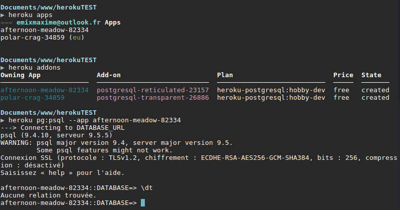

# Présentation

Cette partie du Wiki est destinée aux étudiants de première année en DUT Informatique à l'IUT de Calais.
La présentation porte ici non pas sur le code, mais sur **la base de donnée**.  
Objectif : vous mettre à jour..

# Status :
En cours de rédaction...

# Navigation :
- [Voir les nouvelles conventions](https://github.com/EmixMaxime/learn-nodejs-bydoing/blob/master/wiki/dutinfo/normalizations.md)
- [Relationships](https://github.com/EmixMaxime/learn-nodejs-bydoing/tree/master/wiki/dutinfo/relationship)

# Des outils pratique !
## [Vertabelo](https://www.vertabelo.com/)
Vertabelo est un outil en ligne **gratuit** qui vous propose de schématiser vos bases de données (création d'entités avec leurs attributs).
Ne soyez pas surpris, les schémas ne sont pas les mêmes que ceux étudiés en cours. Si vous doutez de la conformité de ceux-ci, il vous suffit d'une simple recherche google : **"database modelling normalization"** pour vous retirer ces doutes.
 
Il n'y a qu'en réalité la modélisation de la cardinalité qui change pour être plus visuel : d'un cout d'oeil on peut reconnaître si c'est une relation oneToOne ou OneToMany. *(allez voir le guide sur les relations !)*

Quelques fonctionnalités cool :
- Modéliser une base de données, puis récupérer le DDL (je vous conseil tout de même de vérifier le DDL il peut y avoir des surprises parfois...)
- Importer un fichier SQL (contenant le DDL) pour générer le schéma.
- Travailler à plusieurs.
- Parler directement sur le site pour s'aider (peu utilisé, vive Facebook Discord... mais ça peut être utile).

Si vous souhaitez vous créer un compte pour les étudiants **c'est gratuit**. Il vous suffit de suivre les instructions (en anglais).

## Heroku
Vous êtes sur windows ? Vous souhaitez tout de même utiliser postgres ? Cette solution est faite pour vous ! 
Heroku est un cloud qui permet d'héberger des instances d'applications. Je parle chinois? Vous allez pouvoir **avoir votre propre serveur SQL en ligne** (postgresql ou mysql...). Ce qui est plutôt cool? C'est **gratuit** *(512mb de ram, mais pour une instance de postgresql ? ça suffit !)*.
 
- Créez-vous un compte sur leur [site](https://heroku.com).
- Installez leur CLI, suivez les [instructions](https://devcenter.heroku.com/articles/heroku-command-line).
- Connectez-vous : `heroku login` dans un terminal.
- Créez votre database : `heroku addons:create heroku-postgresql --app nomDeVotreApp
- Connectez-vous à votre base : `heroku pg:psql --app nomDeVotreApp`
## Exemple :
Voici la connexion à ma base en vérifiant qu'elle est bien active. *(oui j'ai une autre base sur une autre application, mais c'est secret défense chef!)*  
  
Bien-sûr cette plateforme vous permet de faire beaucoup d'autres choses *(applications php, nodejs, ruby... :o)*.

## DataGrip : un IDE SQL
Description à venir...
