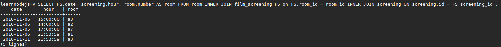

# La relation manyToMany
Cette relation est la plus compliquée mais également très importante alors accrochez-vous ! <br />

# Exemple 1 :
On va commencer en douceur avec un exemple typique. <br />
Sur un blog, il y a des articles qui appartiennent souvent à tes tags / catégories. <br />
- Un article peut avoir plusieurs catégories
- Une catégorie peut être liée à plusieurs articles <br />
Vous voyez le problème venir? Non? Je vous avais dit d'éviter les kebabs pour cette partie... <br />

Ici nous allons avoir besoin d'une table intermédiaire pour stocker 2 clefs étrangères : `article_id` et `category_id`.
En relation nous avons : `article` hasMany `category` mais aussi `category` **hasMany** `article` ! <br />
Cette table **intermédiaire/pivot/jointe** suit une convention pour son nom, je vous conseille de lire [ce guide](./normalizations.md) :-)

## Le schéma :
 <br />

# Exemple 2 :
Désactivez le mode yolo ici svp. <br />
Nous allons prendre ici l'exemple de mon projet avec mon entité `film_screening` qui n'est ni plus ni moins qu'une table **pivot**. <br />
- Un film peut être diffusé plusieurs fois : `film` hasMany `screening` *(rappel screening = heure de séance!)*
- Une heure de séance peut être liée à plusieurs films : `screening` hasMany `film` <br />
**Oh une belle relation manyToMany** *(ohh c'est de toute beauté)* <br />
Mais ce n'est pas fini !
- Un film peut être diffusé dans plusieurs salles : `film` hasMany `room`
- Une salle peut être utilisée pour diffuser plusieurs film : `room` hasMany `film`
**Oh une belle relation manyToMany** <br />

Ansi j'ai appellée ma table pivot `film_screening` en prenant la convention mais en supprimant le _room. C'est pour éviter de surcharger.
<br />
Cette table fait la liaison entre mes entités : `film screening room`. Et elle est elle-même référencée par `sale`. <br />
J'espère ne pas vous avoir perdu, si c'est le cas ne partez pas sur la lune mais faite le moi savoir :-)

## En action :
Je souhaite récupérer les heures où une salle est réservée. Ici nous allons prendre également les date, on pourrait très bien imaginer ajouter une clause WHERE à cette requête pour récupérer ces informations pour aujourd'hui. Rappel : fonction NOW(). <br />
```SQL 
SELECT FS.date, screening.hour, room.number AS room
FROM room
INNER JOIN film_screening FS
	ON FS.room_id = room.id
INNER JOIN screening
	ON FS.screening_id = screening.id
```
Résultat exemple de résultat : <br />
 <br />