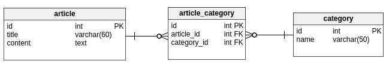

# Parlons de 'normalisations' des relations
Le monde informatique évolue de plus en plus vite, les applications deviennent de plus en plus compliquées.  
Il faut alors des normes pour aider les développeurs. Lorsque vous chercherez de l'aide sur Internet vous les trouverez toujours avec ces normes, sauf si les sujets datent d'une dizaine d'année.

# Les attributs clés étrangères
Une règle simple : le nom de l'entité référée en préfixe de **`_id`**  
Mon entité a une clef étrangère vers l'entité `client` ? L'attribut se nommera alors : `client_id`  
**Si vous regardez mon schéma, vous devez vous en rendre compte.**

# ManyToMany
On reprend notre exemple avec nos catégories et nos articles :  
  
Le nom de notre table pivot suit une norme.
Cette table réunit l'entité `category` et `article`, son nom est créé en fusionnant ces 2 noms espacés par un underscore par ordre alphabétique.  
Tous ces noms de tables ne sont pas normalisés et donc vivement déconseillés de nos jours :
	- category_article
	- article-avoir-category
  
## Resources :
Si vous souhaitez aller plus loin je vous conseil ces ressources :
- [implémentation sur postgres]http://stackoverflow.com/questions/9789736/how-to-implement-a-many-to-many-relationship-in-postgresql)
- [explication de la norme en profondeur](http://dba.stackexchange.com/questions/63389/database-design-normalizing-a-many-to-many-to-many-relationship
**A noter : cette norme date de plus de 4 ans :-)**  