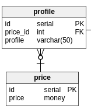

# La relation OneToMany
Ahh, cette relation est **très très utilisée** ! Alors accrochez-vous *(c'est simple, don't worry!)* <br />

# Exemple 1 :

Sur mon projet, j'avais besoin d'une entité prix. <br />
- Un étudiant paye 5€
- Un adule paye 7€ <br />

Le problème intervient lorsque le prix se répète. Si j'ai les enfants qui payent également 5€ il y aura redondance de données. <br />
J'avais donc deux tables à mettre en relations :
- price
- profile <br />

Si vous avez bien suivi, un `profile` peut appartenir à plusieurs `price`. Exemple : <br />
- Les enfants payent 5€
- Les étudiants payent 5€
- Les adultes payent 7€ <br />

On dit que `price` **hasMany** `profile`. <br />
Retenez bien cette phrase, vous la retrouverez partout !

## Réalisation :
Dois-je mettre l'attribut `price_id` dans l'entité `profile` **ou alors** l'attribut `profile_id` dans l'entité `price` ? <br />
Pour ne pas parler chinois *(avec la cardinalité)* on part de la logique : <br />
Je dois mettre un attribut `price_id` dans `profile` car l'autre proposition ne fonctionne pas : <br />

*en admettant que profile_id = 1 soit pour les étudiants, et que profile_id = 2 soit pour les enfants* <br />

| price         | value         |
| ------------- |:-------------:|
| profile_id    | 1				|
| price         | 7€	        |

| price         | value         |
| ------------- |:-------------:|
| profile_id    | 2				|
| price         | 7€	        |

On voit bien apparaître ici une redondance de la donnée price... Et cela n'est absolument pas bon ! <br />
**La clef primaire doit toujours être dans la table où la cardinalité est la plus forte.
xxx hasMany yyy, alors yyy contiendra une clef étrangère xxx_id.**

L'autre proposition me donnerai la relation : `profile` **hasMany** `price`. **Et ce n'est pas la même chose !** <br />
Voici le résultat : <br />
 <br />


# Exemple 2 :
Nous allons prendre un cas plus compliqué et plus complet que le précédent.
Cette partie nous servira pour ensuite étudier les relations de type manyToMany qui sont bien plus compliquées. </br>
Pour l'illustrer, prenons ma relation entre film et film_screening *(film_screening = séance)*
 <br />
On part de la réalité :
- Un film peu être diffusé dans plusieurs séances différentes <br />
Exemple : Camping 3 peut être diffusé à 14h puis à 16h puis.. jamais #troll <br />
Rappel : On dit qu'un `film` **hasMany** `film_screening`.
*(la cardinalité est de 1,n de `film` vers `film_screening`)* <br />

## La réalisation
Je dois mettre un attribut `film_id` dans `film_screening` car notre relation c'est : `film` **hasMany** `film_screening`.

## En action
Je souhaite récupérer toutes les séances du film ayant l'id 1 :
```SQL
SELECT * FROM film F
INNER JOIN film_screening FS
    ON FS.film_id = F.id
WHERE F.id = 1;
```
Et le résultat :
 <br />
Les requêtes peuvent ensuite se compliquer. <br />

- Je souhaite avoir les films avec leur séances d'aujourd'hui (future) avec la salle et l'heure. <br />
**Oulaaa... c'est un peu trop compliqué chef?**
Lorsqu'on a une grosse requête, on la décompose :
- Je récupère les films avec leur séances (select avec un inner join)
- Je récupère l'heure de la séance (présente dans l'entité `screening`)
- J'ajoute la clause WHERE pour filtrer les séances d'aujourd'hui (sur l'attribut `film_screening.date`)
- J'ajoute une autre clause, pour filtrer les séances futures (sur l'attribut `screening.hour`) <br />
**Pensez à ajouter une séance qui correspond à la demande, sinon vous aurez toujours un résultat vide... à vous de jouer pour ajouter ce tuple**. <br />
```SQL
SELECT F.*, S.*  FROM film F
INNER JOIN film_screening FS
	ON FS.film_id = F.id
INNER JOIN screening S
	ON S.id = FS.screening_id
WHERE FS.date = now()::DATE
	AND S.hour > now()::TIME
;
```
est le tour est joué ! <br />
Vous devez être entrain de vous demander, d'où ça vient le `now()::TIME` et le `now()::DATE`. ??? <br />
- La fonction NOW() retourne le timestamp avec la timezone. (plus d'info ? **La documentation : [function now](http://devdocs.io/postgresql~9.6/functions-datetime#now**) ) <br /> en bref ? c'est **la date et l'heure actuelle**
- ::DATE ::TIME ? C'est en réalité un raccourci pour réaliser un **CAST**. now() retournant un timestamp et le champ FS.date étant de type date il y aurait erreur, je suis alors obligé de **caster** le type timestamp vers date.

## Ressources à lire :
- Qu'est-ce qu'un cast ? (ressource à venir...)