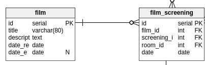
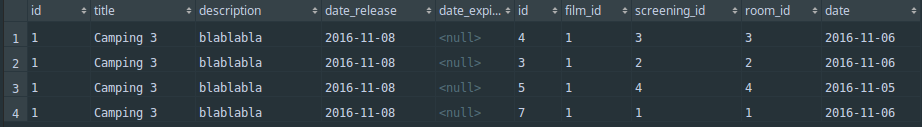

# La relation OneToMany
Ahh, cette relation est **très très utilisée** ! Alors accrochez-vous *(c'est simple, don't worry!)* <br />
Pour l'illustrer, prenons ma relation entre film et film_screening (film_screening = séance)
 <br />
On part de la réalité :
- Un film peu être diffusé dans plusieurs séances différentes <br />
Exemple : Camping 3 peut être diffusé à 14h puis à 16h puis.. jamais #troll <br />
On dit qu'un `film` **hasMany** `film_screening`.
*(la cardinalité est de 1,n de `film` vers `film_screening`)* <br />

## La réalisation
Dois-je mettre l'attribut `film_id` dans l'entité `film_screening` **ou alors** l'attribut `film_screening_id` dans l'entité `film` ? <br />
Pour ne pas parler chinois *(avec la cardinalité)* on part de la logique : <br />
Je dois mettre un attribut `film_id` dans `film_screening` car l'autre proposition ne fonctionne pas :
- Comment mettre plusieurs `film_screening` si j'ai l'attribut `film_screening_id` dans `film` ? <br />
L'autre proposition me donnerai la relation : `film_screening` **hasMany** `film`. **Et ce n'est pas la même chose !** <br />
Ensuite il me suffit d'ajouter la clef étrangère sur ma table `film_screening` et le tour est joué !

## En action
Je souhaite récupérer toutes les séances de film pour le film ayant l'id 1 :
```SQL
SELECT * FROM film F
INNER JOIN film_screening FS
    ON FS.film_id = F.id
WHERE F.id = 1;
```
Et le résultat :
 <br />
Les requêtes peuvent ensuite se compliquer. <br />

- Je souhaite avoir les films avec leur séances d'aujourd'hui (future) avec la salle et l'heure. <br />
**Oulaaa... c'est un peu trop compliqué chef?**
Lorsqu'on a une grosse requête, on fait pas à pas :
- Je récupère les films avec leur séances
- Je récupère l'heure de la séance (présente dans l'entité `screening`)
- J'ajoute la clause WHERE pour filtrer les séances d'aujourd'hui (sur l'attribut `film_screening.date`)
- J'ajoute une autre clause, pour filtrer les séances futures (sur l'attribut `screening.hour`) <br />
**Pensez à ajouter une séance qui correspond à la demande, sinon vous aurez toujours un résultat vide... à vous de jouer pour ajouter ce tuple**. <br />
```SQL
SELECT F.*, S.*  FROM film F
INNER JOIN film_screening FS
	ON FS.film_id = F.id
INNER JOIN screening S
	ON S.id = FS.screening_id
WHERE FS.date = now()::DATE
	AND S.hour > now()::TIME
;
```
est le tour est joué ! <br />
Vous devez être entrain de vous demander, qu'est-ce le `now()::TIME` et le `now()::DATE`. <br />
- La fonction NOW() retourne le timestamp avec la timezone. (plus d'info ? **La documentation : [function now](http://devdocs.io/postgresql~9.6/functions-datetime#now) ) <br /> en bref ? c'est **la date et l'heure actuelle**
- ::DATE ::TIME ? C'est en réalité un raccourci pour réaliser un **CAST**. now() retournant un timestamp et le champ FS.date étant de type date il y aurait erreur, je suis alors obligé de **caster** le type timestamp vers date.

## Ressources à lire :
- Qu'est-ce qu'un cast ? (ressource à venir...)