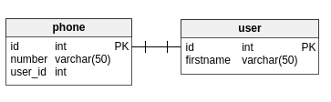

# La relation oneToOne
Pourquoi commencer par cette relation ? Car c'est la **plus simple !**  
Je n'ai pas utilisé de relation oneToOne ici car je ne pouvais pas, je vais donc prendre un exemple fréquemment présenté sur le web :  
Nous avons une entité `user` qui va être en relation avec l'entité `phone`.  
On dit alors que l'user **hasOne** phone.
Voici le schéma de l'exemple :  
  
Vous pourrez vous demander à quoi ça sert. Je pourrais très bien mettre `phone.number` dans l'entité `user` !  
## Attention :
Il ne faut pas l'utiliser partout pour faire "beau". Si vous souhaitez savoir quand et pourquoi l'utiliser je vous ai trouvé une réponse sur stackoverflow excellente [ici](http://stackoverflow.com/a/12321323)  
Pour commencer, ne **l'utilisez pas** (sauf si vous comprennez réellement à quoi elle sert).
