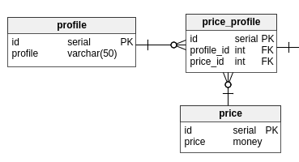

# Relationship ? Relations ? Associations ?
Vous verez sûrement souvent (voir même très souvent) ces mots. Mais que veulent-t-ils dire ?  
*Exemples types :relationships between database tables, oneToOne manyToOne relationsships*  
*Exemples de documentations qui parlent de relationships (les 2 frameworks PHP les plus populaire / utilisé dans le monde) : [symfony](http://symfony.com/doc/current/doctrine/associations.html), [laravel](https://laravel.com/docs/5.3/eloquent-relationships#many-to-many)*  

En français on parle de **relations, associations** entre les tables. (attention, ici je différencie bien relations et tables... ça peut être assez confus, mais retenez le bien).
 

Parfois une table doit être mise en **relation** avec une autre (oui les foreign_key !).  
Prennons de suite un exemple pour éviter l'abstrait :  
Sur mon projet, j'avais besoin d'une entité prix.  
- Un étudiant pai 5€
- Un adule pai 7€  
Le problème intervient lorsque le prix se répète. Si j'ai les enfants qui paie également 5€ il y aura redondance de données.  
J'ai donc choisi de créer trois tables :  
- price
- profile
- price_profile  
Ainsi j'évite toute possibilité de redondance :-) (imaginons également, des offres promotionnelles...).  
  
Ici nous parlons de **relation** entre la table price et price_profile. Elles sont liées ! Mais de même pour profile et price_profile.
*(d'ailleurs, lorsque je regarde la structure de mon entité price : `\d price` postgres m'affiche qu'elle est référencée par la table price_profile)*.  
La table price_profile est appellée table pivot, table intermédiaire...  
Je vous ai perdu? Table pivot? Relations manyToMany ?
 
Je vous invite maintenant à lire le document où je vous parle des différents types de relation.

## Les différents types de relation
- [OneToOne](#) (la plus simple)