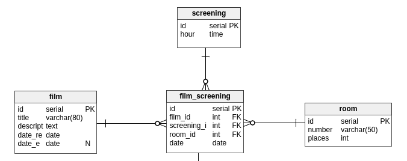

# Relationship ? Relations ? Associations ?

## Navigation
### Les différents types de relation
- [OneToOne](https://github.com/EmixMaxime/learn-express-bydoing/blob/master/wiki/dutinfo/relationship/oneToOne.md) (la plus simple)
- [OneToMany](https://github.com/EmixMaxime/learn-express-bydoing/blob/master/wiki/dutinfo/relationship/oneToMany.md)

## Introduction 
Vous verez sûrement souvent (voir même très souvent) ces mots. Mais que veulent-ils dire ?  
*Exemples types :relationships between database tables, oneToOne manyToOne relationships*  
Exemples de documentations qui parlent de relationships :
- [symfony](http://symfony.com/doc/current/doctrine/associations.html) et [laravel](https://laravel.com/docs/5.3/eloquent-relationships#many-to-many) *(les 2 frameworks PHP les plus populaires / utilisés dans le monde).*
- [Django](https://docs.djangoproject.com/en/1.10/topics/db/examples) *(le framework de référence pour le langage python).
- Et encore d'aures...

En français on parle de **relations, associations** entre les tables. (attention, ici je différencie bien relations et tables... ça peut être assez confus, mais retenez le bien).
 
Parfois une table doit être mise en **relation** avec une autre / des autres (oui les foreign_key !).  
Exemple de relations entre 2 tables :  
  
Ici nous parlons de **relation** entre la table price et profile.
*(d'ailleurs, lorsque je regarde la structure de mon entité price : `\d price` postgres m'affiche qu'elle est référencée par la table profile)*.  
Exemple de relations entre 4 tables :
  