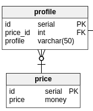

# Relationship ?
Vous verez sûrement souvent (voir même très souvent) ce mot. Mais que veut-il dire ?  
En français on parle de relations entre les tables. (attention, ici je différencie bien relations et table... ça peut être assez confus, mais retenez le bien.)
 
Parfois une table doit être mise en relation avec une autre (oui les foreign_key !).  
Prennons de suite un exemple pour éviter l'abstrait :
Sur mon projet, j'avais besoin d'une entité prix.  
- Un étudiant paie 5€
- Un adule paie 7€
Le problème intervient lorsque le prix se répète. Si j'ai les enfants qui paie également 5€ il y aura redondance de données.  
J'ai donc choisit de créer deux tables :
- price
- price_profile
Ainsi j'évite toute possibilité de redondance :-) (imaginons également, des offres promotionnelles...).  
  
Ici nous parlons de **relation** entre la table price et price_profile. Elles sont liées !
*(d'ailleurs, lorsque je regarde la structure de mon entité room : `\d room` postgres m'affiche qu'elle est référencé par la table film_screening)*

## Les différents type de relation
- [OneToOne](#) (la plus simple)
